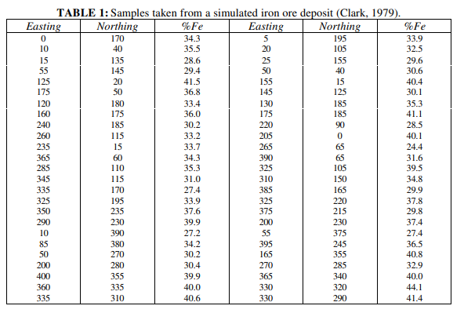
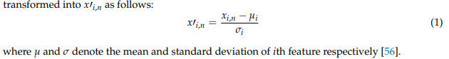

# Ore grade estimation with deep neural network

The original paper  [Ore Grade Estimation with Modular Neural
Network Systems – A Case Study](https://www.academia.edu/20216644/ore_grade_estimation_with_modular_neural_network_systems_a_case_study) publish in 1998,

## Dataset 



## Normalization



source : [A New Ore Grade Estimation Using Combine Machine Learning Algorithms](https://www.mdpi.com/2075-163X/10/10/847)

## Run 

### Step 1 : run the install.sh

```
./install.sh
```

### step 2 : run the main.py

```
cd main && py main.py
```


